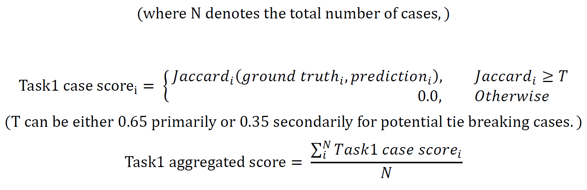
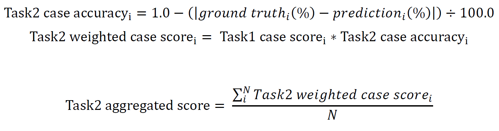

<!-- PROJECT LOGO -->
<p align="center">
    <a href="https://paip2019.grand-challenge.org">
        
    </a>
    <h3 align="center">PAIP2019</h3>
    <p align="center"> 
        PAIP2019 is the first challenge organized by the Pathology AI Platform (PAIP)
       <br>
        <a href="https://paip2019.grand-challenge.org/"><strong>PAIP2019 homepage</strong></a>
    </p>      
</p>


<!--Table of Contents--!>

<strong>Table of contents</strong>
<details open="open">
    <ol>
        <li>
            PAIP2019 Challenge
            <ul>
                <li>background</li>
                <li>dataset</li>
                <li>evaluation</li>
            </ul>
        </li>
        <li>
            Our method
            <ul>
                <li>
                <strong>Task 1: Liver Cancer Segmentation</strong>
                <p>
                    a
                </p>
                </li>
                <li>
                <strong>Task 2: Viable Tumor Burden Estimation</strong>
                <p>
                </p>
                </li>
            </ul>
        </li>
        <li>
            Results
        </li>
        <li>
            prerequisites
        </li>
      
    </ol>
</details>


<!--PAIP2019 challenge-->
## PAIP2019 Challenge
<ul>
    <li>
        <strong>background:</strong>
        <p>
        </p>
    </li>
    <li>
        <strong>dataset</strong></li>
        <p>
           <ul>
                <li>The training dataset contains 50 WSIs</li>
                <li>The validation dataset contains 10 WSIs</li> 
                <li>The test dataset contains 40 WSIs</li>
                <p>
                    All WSIs were scanned at 40X magnification
                </p>
           </ul>
        </p>
    <li>
        <strong>evaluation</strong>
        <ul>
            <li>
               <strong>Task1: Cancer segmentation</strong>
               <p>
                      
               </p> 
            </li>
            <li>
                <strong>Task2: Viable Tumor Burden Estimation</strong>
                <p>
                    Each Task1 case score is used as a weight for each Task2 case score.
                      
                </p>
            </li>
        </ul>
    </li>
 

</ul>

<!-- Our method -->
## Our method
<p align="center">
    
    <h5 align="center">Figure1.Overview</h5>
</p>

<!-- Results -->
## Results
<ul>
    <li>
        <strong>Validation Results</strong>
        <p>28 Aug. 2019,Task1 score:0.6975,Task2 score: 0.6558/p>
    </li>
    <li>
        <strong>Test Results</strong>
        <p>Sept. 10, 2019, 12:33 a.m.,Task1 rank: 14,Task1 score: 0.665227214,Task2 rank:7, Task2 score :0.633028622</p>
    </li>
</ul>

<!--prerequisites-->
## prerequisites
* imgaug
  ```sh
  pip install imgaug
  ```
* openslide-python
  ```sh
  pip install openslide-python
  ```
* tifffile
  ```sh
  pip install tifffile
  ```

