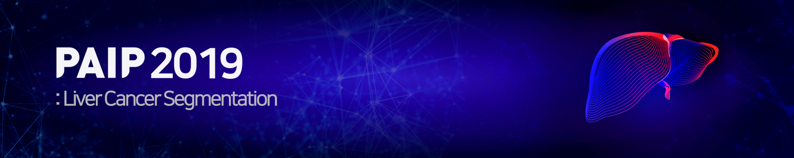

<!-- Our method -->
## Our method
<p>


  If you want more details, please visit my blog.
  <h3><a href="https://chhan95.github.io/project/2021/03/15/paip2019.html">Details for train and infer</a></h3>

</p>

<!--Prerequisites-->
## Prerequisites
* docopt
  ```sh
  pip install docopt
  ```
* imgaug
  ```sh
  pip install imgaug
  ```
* openslide-python
  ```sh
  1. Download the project from openslide-python github

     python setup.py install
  ```
  ```sh
  2. pip install openslide-python
  ```

* tifffile
  ```sh
  pip install tifffile
  ```


<!--Support format-->
## Support format
openslide was used to read WSI.

I tested .svs and .ndpi format.

If you want to use another format, add the command at inferManager.py(line :61)
<br>ex)wsi_list += glob.glob(self.input_path+"/*.ndpi")

<!--Support format-->
## Thumbnail
Because of the spatial size of WSI, it's not efficient to allocate the memory for chekcing the rusults corresponding with the original WSI.
So, you can see the thumbnails at "output/thumbnail" folder.
You can change '--rescale' arguments to adjust rescale factor for WSI in interval (0,1).
If you make it into another range of input(ex -1), the program don't generate thumbnail.

If you want to use another format, add the command at inferManager.py(line :61)
<br>ex)wsi_list += glob.glob(self.input_path+"/*.ndpi")
<!-- How to use -->
## How to use
Code Structure
```
├── classification_model
|
├── segmentation_model                  
|
├── infer
|   ├── inferManager.py
|
├── dataset
|   ├── example1.svs
|   ├── example2.svs
|   ├── ....
|
├── output
|   ├── prediction
|   ├──   ├── example1_v.tif
|   ├──   ├── example2_v.tif
|   ├──   ├── ....
|   ├──   ├── example1_wt.tif
|   ├──   ├── example2_wt.tif
|   ├──   ├── ....
|   |
|   ├── thumbnail
|   ├──   ├── example1_v.png
|   ├──   ├── example2_v.png
|   ├──   ├── ....
|   ├──   ├── example1_wt.png
|   ├──   ├── example2_wt.png
|   ├──   ├── ....
|
├── pretrained
|   ├── whole_cls_tumor_net.pth
|   ├── ambiguours_tumor_net.pth
|   ├── viable_tumor_net.pth
|   ├── viable_seg_net.pth
|
├── model
├── run_infer.py
├── run_infer.sh
├── ....
```

Only support a single GPU, it will take 10 minutes per each WSI(40x).
<p align="center">
  <ol>
    <li> Put your data into input_path(default: ./dataset)
    <li> Download pretrained models into "./pretrained"
      <p>
        <a href="https://drive.google.com/drive/folders/1_XYv5gVB0OoAK8-GU5A64cVMQmkdd0He?usp=sharing">Pretrained model Link</a>
      </p>
    <li> Run run_infer.sh
    <li> You can see your result at output_path(default: ./output).
      <p>
        prediction: This folder contains the binary maps of the segmentation results corresponding with original WSIs(1-to-1 mapping).
        <ul>
          <li> "?_v.tif" : viable tumor prediction
          <li>"?_wt.tif" : whole tumor area prediction
        </ul>
      </p>
      <br>
      <p>
      thumbnail: This folder contains thumbnails, the resized segmentation results, which can be scaled by the "--rescale" arguments in a range of (0,1)
        <ul>
          <li> "?_v.png" : viable tumor resized image
          <li>"?_wt.png" : whole tumor resized image
        </ul>
      </p>
  </ol>
</p>


<!--Dataset-->
## Dataset
<p align="center">
    <a href="https://paip2019.grand-challenge.org">
        
    </a>
    <h3 align="center">PAIP2019</h3>
    <p align="center">
        PAIP2019 is the first challenge organized by the Pathology AI Platform (PAIP)
       <br>
        <a href="https://paip2019.grand-challenge.org/"><strong>PAIP2019 homepage</strong></a>
    </p>      
</p>

<ul>
    <li>
        <strong>Background:</strong>
        <p>
          Liver cancer is one of the most common cancer. For the best prognosis of patients, early diagnosis of liver cancer is crucial task.
          In this project, we proposed the method for whole and viable liver tumor segmentation.
          <ul>
              <strong>Tumor definition</strong>
               <li>Whole tumor area: This area is defined as the outermost boundary enclosing all dispersed viable tumor cell nests, tumor necrosis, and tumor capsule. </li>
               <li>Viable tumor area: This region is defined as viable tumor cell nests and as precisely as possible, boundaries along the boundary between the cell and the surrounding stroma. </li>
          </ul>
        </p>
    </li>
    <li>
        <strong>Dataset</strong></li>
        <p>
           <ul>
                <li>The training dataset contains 50 WSIs</li>
                <li>The validation dataset contains 10 WSIs</li>
                <li>The test dataset contains 40 WSIs</li>
           </ul>
        </p>
    <li>
        <strong>Evaluation</strong>
        <ul>
            <li>
               <strong>Task1: Liver Cancer Segmentation</strong>
            </li>
            <li>
                <strong>Task2: Viable Tumor Burden Estimation</strong>
            </li>
        </ul>
    </li>


</ul>


<!-- Results -->
## Results

<p align="center">
    <a href="https://paip2019.grand-challenge.org">
        
    </a>
    <p align="center">
        Figure1. Test set segmentation results
    </p>      
</p>

<ul>
    <li>
        <strong>Validation Results</strong>
        <ul>    
            <li>28 Aug. 2019</li>
            <li>Task1 score:0.6975</li>
            <li>Task2 score: 0.6558</li>
        </ul>
    </li>
    <li>
        <strong>Test Results</strong>
        <ul>
            <li>Task1 rank: 5th</li>
            <li>Task1 score: 0.665227214</li>
            <li>Task2 rank: 3rd</li>
            <li>Task2 score :0.633028622</li>
        </ul>
    </li>
</ul>


<!--Presentation-->
## Additional Resources
<ul>
    <li>
        <a href="https://drive.google.com/file/d/12ReGYi7UZF7lPau33RnMqzxeMJWCdfJj/view">Our method PPT</a>
    </li>
    <li>
        <a href="https://www.sciencedirect.com/science/article/pii/S1361841520302188">Challenge paper</a>
    </li>
</ul>
